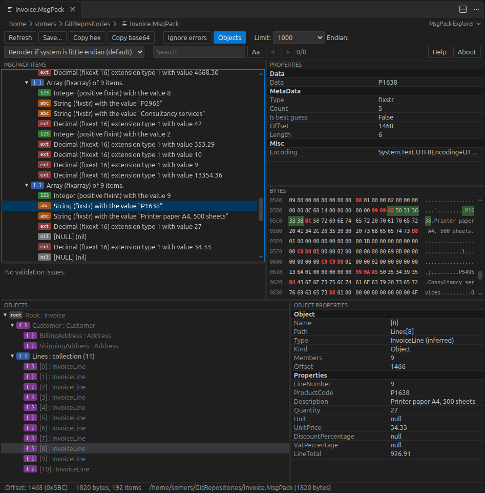

# MsgPack Explorer for VS Code

Inspect MsgPack data while debugging, and in `.msgpack` files. At the top low level MsgPack items tree with HEX viewer and exact type information. The bottom half (may be toggled on or off) shows higher level objects with their properties.

**Requires the .Net 8 (or higher) runtime**.

## While debugging

Pause the program, then:

- right-click a variable in the **Variables** view and choose **View as MsgPack**, or
- run **MsgPack: Inspect Expression...** from the Command Palette and type an expression (evaluated in the stack frame selected in the Call Stack view).

For .Net:

| Value | How it is read |
|---|---|
| `byte[]` |  |
| `MemoryStream` | `ToArray()`: the whole stream, its position does not change |
| other `Stream`s | seekable: from the start, then the position is put back. Not seekable: from the current position, after you confirm (the program cannot read those bytes any more) |
| `List<byte>`, `ArraySegment<byte>` and other `IEnumerable<byte>`, `Memory<byte>`, `ReadOnlyMemory<byte>`, `ReadOnlySequence<byte>` | converted to an array |
| `HttpResponseMessage`, `ByteArrayContent` and other `HttpContent` | `ReadAsByteArrayAsync().Result` |
| `string` | base64, hex or delimited values |

Other debuggers:

- **JavaScript** (Node.js, Chrome, Edge): `Uint8Array`, `Buffer`, `ArrayBuffer`, `DataView` and other typed arrays, arrays of numbers, strings.
- **Python** (debugpy): `bytes`, `bytearray`, `memoryview`, `io.BytesIO`, lists of ints, strings.
- **Any debugger**: the elements the Variables view shows for an array (also in groups like `[0..99]`), or a string holding the bytes.

Large values are read up to `lsmsgpack.maxBytes` (16 MB by default).

## Files and text

- `.msgpack`, `.MsgPack` and `.mpk` files open in the explorer (**Reopen Editor With...** switches to the text or hex editor). Other files: **MsgPack: Open File...**. The view follows changes of the file.
- **MsgPack: Explore Bytes from Clipboard** and **Explore Selected Text as MsgPack** (editor context menu) read bytes written as text: hex (`0x81A3...`, `81 A3 ...`, `81-A3-...`), base64, delimited decimal values (`[129, 163, ...]`, e.g. copied from a debugger) or a Python bytes literal (`b'\x81\xa3'`).

## Requirements

The data is read by the LsMsgPack library itself (the same code as the Visual Studio visualizer), in a small .NET program that comes with the extension. It needs the **.NET runtime 8 or later** (`dotnet` on the PATH, or set `lsmsgpack.dotnetPath`).

## Settings

| Setting | Default | |
|---|---|---|
| `lsmsgpack.dotnetPath` | `dotnet` | The `dotnet` executable that runs the inspector. |
| `lsmsgpack.displayLimit` | 1000 | The number of items shown at first (0: no limit). |
| `lsmsgpack.maxBytes` | 16777216 | The most bytes read from the debugged program. |
| `lsmsgpack.chunkSize` | 49152 | Bytes per evaluation in the debugger (made smaller automatically when the debugger shortens long strings). |

## Views:

- **MsgPack items**: the tree of the data, every item with its MsgPack type and value. Keys and values of maps are marked, items of the indexed schema are shown in blue, items read after an error in gray.
- **Bytes**: the hex view. The type byte of each item is red, the bytes holding a length are blue, bytes after the data are gray. The selected item is highlighted, clicking a byte selects its item.
- **Properties**: what the explorer's property grid shows for the selected item (type, offset, length, count, value...), with the description of the selected property.
- **Validation**: issues of the data (a smaller encoding would have saved bytes, keys of different types, duplicate keys, where reading stopped). Clicking one selects the item.
- **Objects**: the objects the data was written from, reconstructed without the types: type names and property names from the indexed schema of [LsMsgPack](https://github.com/mlsomers/LsMsgPack) (shown automatically when the data has a schema), or the values by position. Selecting an object selects its bytes.
- **Search**: strings containing the text, and values the text converts to (numbers, true/false, null, Guids, dates and times). Enter for the next, Shift+Enter for the previous.
- **Limit**, **Endian** and **Ignore errors** like the Visual Studio visualizer: show more items, read numbers in another byte order, keep reading after a breaking error (best effort).
- **Save**, **Copy hex**, **Copy base64** and **Refresh** (read the value again while the program is paused, or the file again).

## License

Apache License 2.0, © Matheu Louis Somers.
