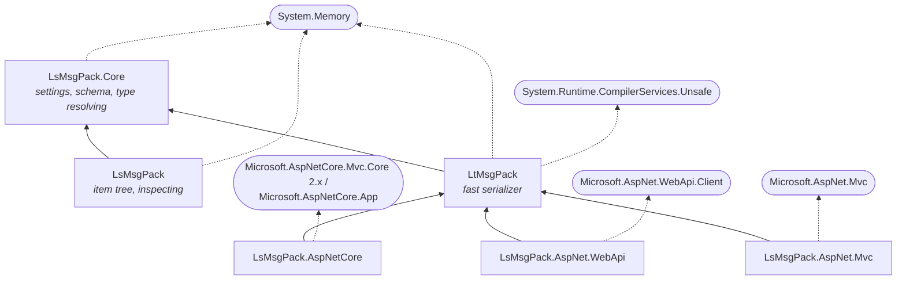

# LsMsgPack
MsgPack serializers for .NET classes (like the xml and json serializers), with an optional indexed schema and type ids for polymorphic object models, ASP.NET formatters, and a MsgPack debugging and validation tool (MsgPack Explorer) that also works as a Fiddler plugin, a Visual Studio debugger visualizer and a VS Code extension.

More info about MsgPack Explorer (and screenshots) can be found at:
http://www.infotopie.nl/open-source/msgpack-explorer

ASP.NET Integration
-------------------

Three packages let ASP.NET controllers and `HttpClient` receive and return MsgPack the same way they handle JSON. Clients choose the format with the `Content-Type` and `Accept` headers: `application/msgpack` (or `application/x-msgpack`) for plain MsgPack that any implementation understands, or `application/x-lsmsgpack` for the indexed schema with type ids (smaller, polymorphic, and with the schema sent only once per client).

| Package | For | Registration |
|---|---|---|
| `LsMsgPack.AspNetCore` | ASP.NET Core 2.x and up | `services.AddControllers().AddLsMsgPackSerializerFormatters();` |
| `LsMsgPack.AspNet.WebApi` | ASP.NET Web API 2, and HttpClient on any platform | `config.Formatters.Add(new LsMsgPackMediaTypeFormatter());` |
| `LsMsgPack.AspNet.Mvc` | ASP.NET MVC 5 | `LsMsgPackMvc.LsMsgPackMvc.Register();` in `Application_Start`, `return this.MsgPack(data);` in actions |

See [docs/WebFormatters.md](docs/WebFormatters.md) for the settings per media type, examples for each package, and how schemas are negotiated.

Client applications
-------------------

The serializers run in any .NET client (WinForms, WPF, MAUI, Avalonia...). Save and load your documents with `LtMsgPackSerializer.Serialize` / `Deserialize`: with the default settings, files are smaller than JSON, keep loading when your classes gain or lose properties, and support polymorphic object models without extra attributes. To call a web service that uses the formatters above, use `LsMsgPack.AspNet.WebApi` with `HttpClient`, or serialize the bodies yourself for any other MsgPack server.

See [docs/ClientApps.md](docs/ClientApps.md) for examples (files, web services, trimming).

Which package
-------------

There are two serializers. They write exactly the same data with the same settings and read each other's output:

- **LtMsgPack** (`LtMsgPack`): use this for normal use. It writes and reads directly from and to your objects. On the invoices of the benchmark it writes about 3-4x and reads about 4x as fast as System.Text.Json, with 35-47% smaller payloads. It also has presets for exchanging data with MessagePack-CSharp, Nerdbank.MessagePack and non-.NET libraries. The web formatters use it.
- **LsMsgPack** (`LsMsgPack`): use this when you really want to inspect MsgPack data in your app. It builds a tree of MsgPack items (maps, arrays, strings...) that you can walk, for any payload, also when you don't have the classes. That makes it much slower: about 2-4x slower than System.Text.Json.

### NuGet packages

Solid arrows are the packages of this repository, dotted ones external dependencies. The web formatters depend on LtMsgPack only, so add `LsMsgPack` yourself when you want to inspect data. Both serializers share `LsMsgPack.Core` and its namespaces (`LsMsgPack.*`), so attributes, type resolvers and filters work with either.

Compatibility with other implementations
----------------------------------------
Serializing classes by creating name-value dictionaries of their properties is not an official standard, and to my surprise I found than a many MsgPack implementations do not. Some just string a list of values into an array. This is indeed efficient and will work well for the first version, however migrating to a new version may pose some compatibility challenges when introducing new properties over time.

For this reason I have submitted a [pull request]( https://github.com/msgpack/msgpack/pull/334/commits/c6a4935b9e0e38818cc1ef878db72621143bfcd7) to the official MsgPack specification, including a more standardized choice of solutions and in addition a standard way to support polymorphic class-hierarchies.

Which settings to use to exchange data with MessagePack-CSharp, Nerdbank.MessagePack, Python, JavaScript and others is described in [docs/Compatibility.md](docs/Compatibility.md).

While using dictionaries diminishes the small size of a MsgPack message, it does help bring up the compatibility level with other serializers (XML / JSON) so that it can be used as a drop-in replacement.

Polymorphic class-hierarchy support
-----------------------------------

- **Indexed schema** (`UseInexedSchema`, on by default): each message starts with a small schema listing every type and its property names once. The body then refers to them by index. This roughly halves the size of messages with repeating objects, and it stays tolerant to adding or removing properties. Other MsgPack implementations don't understand it, so turn it off when they need to read your data.
- **Type ids** (`AddTypeIdOptions`, `IfAmbiguious` by default): adds the type name (or a custom id) when a property holds a derived type. This gives polymorphic class hierarchies (a `List<IPet>` holding cats and dogs) out of the box, without `XmlInclude`-style attributes. The types are found again by their short name, in the assembly of the declared type. When they live elsewhere (e.g. a property declared as `object`, or plugins), register their assembly once with `CacheAssemblyTypes`.
- **Type resolvers** (`TypeResolvers`): control how type ids are written and resolved, for example with short `[XmlRoot]` names, numeric ids, or by recognizing a type from its properties.
- **Plain MsgPack** (`UseInexedSchema = false`, `AddTypeIdOptions = Never`): plain maps of property names and values that any MsgPack implementation can read.

See [docs/schema.md](docs/schema.md) for examples of each wire format, their pros and cons, how polymorphic class-hierarchy support works, and how type ids are resolved.

Reading data you don't trust (request bodies, messages from clients)? Type ids let the data pick the classes that are created: see [docs/security.md](docs/security.md) for what the serializers check and how to limit the allowed types with a type guard.

Fiddler Integration
-------------------

In order to use this tool as a Fiddler plugin, copy the following files to the Fiddler Inspectors directory (usually C:\Program Files\Fiddler2\Inspectors):

- MsgPackExplorer.exe
- LsMsgPackFiddlerInspector.dll
- LsMsgPack.dll
- LsMsgPack.Core.dll

Restart fiddler and you should see a MsgPack option in the Inspectors list.

Visual Studio Integration
-------------------------

The tool can also be used as a debugging Visualizer in Visual Studio. It can be installed via the [Visual Studio Marketplace](https://marketplace.visualstudio.com/items?itemName=mlsomers.V2025102900).

VS Code Integration
-------------------

[LsMsgPackVsCode](LsMsgPackVsCode/README.md) is the same explorer as a VS Code extension (any OS, needs the .NET 8 runtime): right-click a `byte[]`, `Stream`, `List<byte>`, `Memory<byte>`, HTTP content or base64 string in the Variables view while debugging and choose **View as MsgPack**, or open a `.msgpack` file. It also reads typed arrays in JavaScript and bytes in Python.

Source documentation
--------------------

The repository holds the shared core (`LsMsgPack.Core`), the two serializers (`LsMsgPack` with its item tree, `LtMsgPack` without it), the web formatters, MsgPack Explorer with its Fiddler and Visual Studio wrappers, the VS Code extension, and their tests. See [docs/Architecture.md](docs/Architecture.md) for what each project does, how the serializers work, and the class diagrams.
