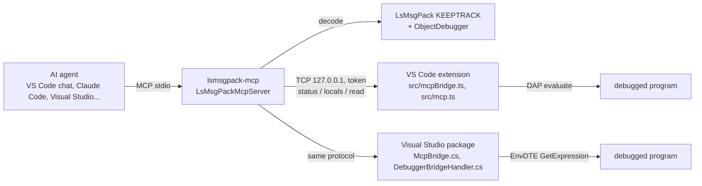

# MsgPack for AI agents (MCP)

`LsMsgPackMcpServer` (assembly `LsMsgPackMcp`, .NET tool `lsmsgpack-mcp`) lets AI agents read MsgPack. It's an MCP server, and a command line tool that runs the same tools. Its [README](../LsMsgPackMcpServer/README.md) covers installing it and adding it to an agent. This page covers how it works and the protocol the IDE extensions speak.

## Why a tool

An agent can't read MsgPack the way it reads JSON:

- Bytes reach it only as hex or base64. That costs several tokens per byte, and base64 can't be decoded reliably bit by bit.
- Decoding hex by hand is sequential work: lengths, big-endian floats, timestamps, UTF-8. Mistakes pile up on real payloads.
- Some data can't be decoded from the bytes alone. The indexed schema writes property ids as indexes into the schema. A schema reference (`WriteSchemaReference`) holds only the id of a schema kept in a `SchemaStore`. The array layout writes values without names.

The server decodes with the library itself (the KEEPTRACK build, like MsgPack Explorer and `LsMsgPackInspector`). It reconstructs the objects with `ObjectDebugger` and writes text: JSON with `//` comments for what JSON doesn't tell.

## Parts



| File | What it does |
|---|---|
| `McpServer.cs` | JSON-RPC 2.0 over stdio, one message per line: `initialize`, `ping`, `tools/list`, `tools/call`, `notifications/cancelled`. Hand-written to avoid depending on a preview SDK. Tool calls run on the thread pool, so a cancellation can reach them. |
| `McpTools.cs` | The tools, their input schemas, and the documents decoded so far (`doc1`, `doc2`...; the last 20 are kept). Errors the agent can act on come back as tool results with `isError`, not as protocol errors. |
| `PayloadDocument.cs` | Unpacks with `PreservePackages` and `ContinueProcessingOnBreakingError` (on by default). Builds the item index (parent, depth, role, schema items) and runs `MsgPackValidation`. Reconstructs the objects (`RootObject`) and maps items to object members. |
| `TextRenderer.cs` | The text: summary, schema, objects view, items view, issues, explaining an offset, search. |
| `IdeBridge.cs` | Finds the IDEs (environment or lock files) and sends them requests. |
| `ByteText.cs` | Bytes written as text, the same formats as the VS Code extension's `bytesFromText.ts`. |
| `Program.cs` | No arguments (or `mcp`): the server. Otherwise the command line: `decode`, `explain`, `search`, `debug status/locals/read`. |

### The output

- **Objects view** (default). The values as JSON. Comments carry types: a type id gives `Dog`, a type inferred from the schema gives `Invoice~`. Comments also mark collection counts, `timestamp`, `decimal`, bin (a 16-byte bin also shown as a Guid), unknown extensions, errors, values read after the first error, and with `offsets` the offset of each value.
  - Small objects and arrays of primitives stay on one line, with the comments of their members merged (`Price: decimal`).
  - Dictionary keys that aren't strings aren't quoted.
- **Items view**. One line per item: offset, indentation, role (`key`, `value`, `[n]`), encoding and value (`uint 16 1234`, `fixext 4, type -1 (timestamp): ...`). The object path is a comment.
- **Limits** keep answers within the agent's context: `maxNodes` (1000), `maxString` (200 chars), 32 bytes of bin shown. `path` and `from`/`to` select a part.
- **Errors** are listed with their offset and object path. `msgpack_explain_offset` shows the items holding a byte, the header and content bytes of its item, and a hex window around it.

## The IDE bridge protocol

Each IDE extension listens on `127.0.0.1` (a free port) and answers one request per connection. The request is one JSON line, and so is the answer:

```json
{"token":"<token>","method":"status","params":{}}
{"result":{...}}            or            {"error":"message"}
```

Requests with another token get `{"error":"Wrong token."}`. Requests longer than 64 KiB are refused.

| Method | Params | Result |
|---|---|---|
| `status` | | `ide` (`vscode`, `visualstudio`), `name`, `workspaceFolders`, `sessions` (`id`, `name`, `type`, `active`), `frame` (`name`, `source`, `line`, `session`; missing while not paused), `expressions` (`paths` or `any`) |
| `locals` | `maxVariables` | `frame`, `variables` (`scope`, `name`, `type`, `value`, `evaluateName`), `truncated` |
| `read` | `expression`, `maxBytes`, `schemaId` | `base64` (or `text`: a string holding the bytes, converted by the server), `description`, `length`, `session`, `warning` |

`read` with `schemaId` reads `((LsMsgPack.SchemaStore)(expression)).GetSchema(LsMsgPack.SchemaId.Parse("<id>"))`. The IDE builds that expression itself after checking the path and the id (32 hex digits). The server registers the schema and decodes again.

**Finding the IDE.** An IDE that starts the server passes `LSMSGPACK_IDE_PORT` and `LSMSGPACK_IDE_TOKEN` in its environment (VS Code through `McpStdioServerDefinition`). Port `0` means that IDE doesn't allow reading from its debugger (`lsmsgpack.mcp.enabled` off): the debugger tools say so, the other tools still work. Otherwise the server reads the lock files in `~/.lsmsgpack/ide` (`LSMSGPACK_IDE_DIR` overrides it):

```json
{"ide":"vscode","name":"Visual Studio Code 1.105.0","pid":1234,"port":51234,"token":"...","workspaceFolders":["/home/me/project"]}
```

Files of processes that are gone are skipped by the server and removed by the IDEs. With several IDEs running, the server uses the one whose workspace holds its working directory (`ide` names one: its pid, `vscode` or `visualstudio`).

**What protects the debugged program:**

- The port only listens on the loopback, and only the user can read the lock file (mode 600 on Unix, the user profile on Windows).
- By default only variable and member paths are evaluated (`isSimplePath` / `SimplePath`: names, `.`, `?.`, `!`, `[number]`, `["key"]`). Property getters still run, as in the Variables view.
- `lsmsgpack.mcp.allowAnyExpression` (VS Code, application scope so a workspace can't set it) or the Visual Studio options page allows any expression.
- A stream that can't seek is consumed by reading it: the IDE asks the user in a modal dialog. VS Code shows a cancellable progress notification while an agent reads, and Visual Studio shows it in the status bar.

Reading itself is the extension's existing code. In VS Code it's `debugBytes.ts` (`readBytes`: .NET, JavaScript, Python, any debugger's array elements). Visual Studio uses a port of its .NET part to EnvDTE `Debugger.GetExpression`, the base64 chunks halved when the debugger shortens strings.

## Tests

- `LsMsgPackMcpServerTests` (in the slnf) covers rendering real LsMsgPack payloads in all layouts (inline schema, schema reference with and without the store, type ids, truncated and corrupt data). It also covers the byte text formats and the MCP protocol, plus the debugger tools against `FakeIde` (a TCP server speaking the bridge protocol).
  - `SampleOutput` writes the output for the sample payloads to the folder in `LSMSGPACK_MCP_SAMPLES`, to read it as an agent would.
- `LsMsgPackVsCode/test/mcpBridge.test.js` covers the bridge (paths, token, lock file). It also starts the .NET server against the TypeScript bridge, the way VS Code starts it.
- The Visual Studio package can't be built on Linux. Its bridge code was compiled against `Microsoft.VisualStudio.SDK` (net472, with the threading analyzers). `McpBridge.cs` was also run against the server with a fake handler.
